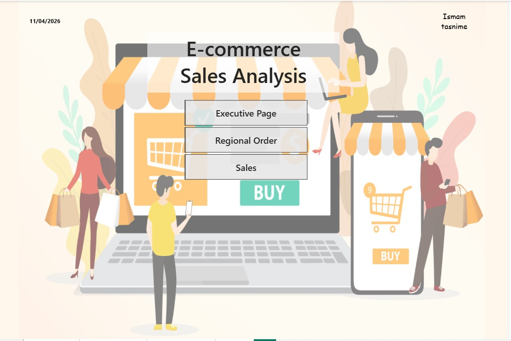
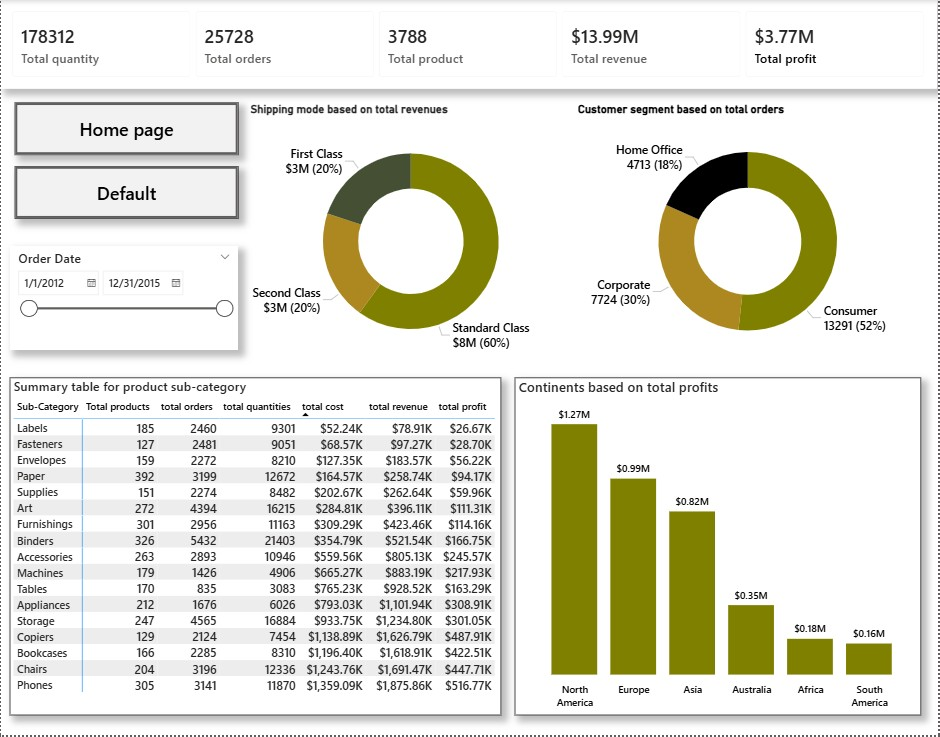
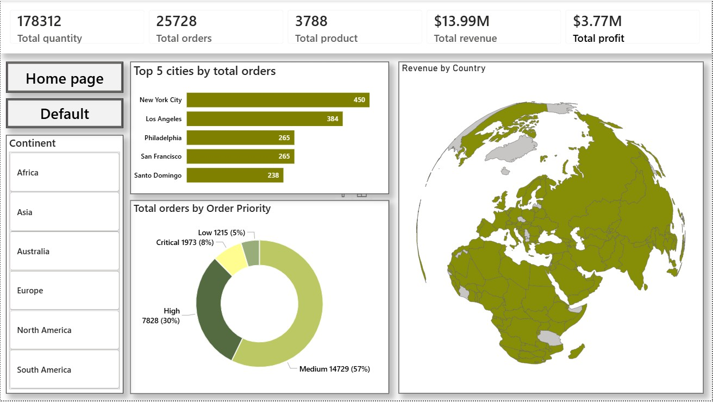
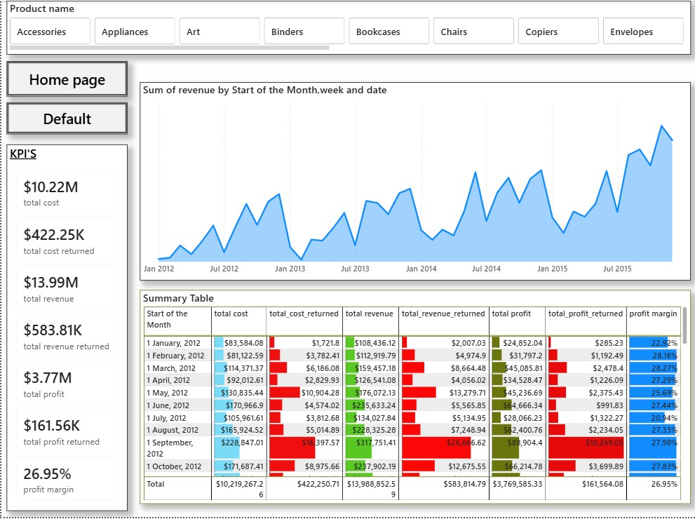

# E-Commerce-Sales-Analysis
This project is a complete end-to-end *E-Commerce Sales Analysis Dashboard* developed in *Microsoft Power BI* to transform raw transactional sales data into meaningful business intelligence and strategic insights.
#  E-Commerce Sales Analysis Dashboard | Power BI Project

  <b>An Interactive Business Intelligence Solution for Revenue, Profitability, Regional Sales, Customer Segmentation, and Operational Performance Analysis</b>

---

#  Project Overview

This project is a complete end-to-end *E-Commerce Sales Analysis Dashboard* developed using *Microsoft Power BI* to transform raw transactional sales data into actionable business intelligence insights.

The dashboard was designed to help analyze and monitor:

- Revenue Performance
- Profitability
- Customer Segments
- Product Performance
- Regional Orders
- Shipping Analysis
- Return Analysis
- Monthly Sales Trends
- Geographic Revenue Distribution

The project combines *advanced data modeling, **custom DAX calculations, **time intelligence functions, and **interactive visualizations* to create a professional analytical reporting solution.

This dashboard allows decision-makers to quickly identify trends, evaluate business performance, monitor KPIs, and explore operational insights through interactive filtering and drill-down analysis.

#  Project Objectives

The main objective of this project was to build a professional business intelligence dashboard capable of:

- Monitoring overall sales and profit performance
- Tracking regional order distribution
- Understanding customer segment contribution
- Analyzing product sub-category performance
- Measuring return impact on profitability
- Exploring revenue trends over time
- Creating dynamic and interactive reporting experiences
- Applying professional BI data modeling techniques

---

# Tools & Technologies Used

| Technology | Purpose |
|---|---|
| Microsoft Power BI | Dashboard Development |
| Power Query | Data Cleaning & Transformation |
| DAX (Data Analysis Expressions) | KPI & Measure Calculations |
| Data Modeling | Relationship Management |
| Star Schema | Fact & Dimension Modeling |
| Snowflake Schema | Product Hierarchy Normalization |

---

#  Data Preparation & Transformation

Before building the dashboard, the dataset was cleaned and transformed using *Power Query*.

## Data Preparation Tasks Performed

- Removed unnecessary columns
- Cleaned inconsistent values
- Organized date fields
- Standardized product hierarchy
- Structured customer and regional information
- Prepared fact and dimension tables
- Optimized relationships for analytical performance

The transformation process ensured better dashboard efficiency and cleaner reporting logic.

---

#  Data Modeling & Schema Design

A professional business intelligence data model was designed to improve analytical performance and maintain clean relationships between datasets.

---

#  Star Schema Implementation

A *Star Schema* structure was implemented to create efficient relationships between the central fact table and supporting dimension tables.

## Fact Table
- Sales Table

## Dimension Tables
- Dim Date
- Dim Region
- Return Table

### Benefits Achieved
- Faster dashboard performance
- Simplified analytical calculations
- Better filtering behavior
- Improved scalability

---

#  Snowflake Schema Implementation

A *Snowflake Schema* approach was used for product hierarchy normalization.

## Product Hierarchy Tables
- Dim Product
- Dim Category
- Dim Sub-Category

### Benefits Achieved
- Reduced data redundancy
- Better hierarchy management
- Improved category-level analysis
- Organized product structure

---

#  DAX Measures & KPI Development

Custom DAX measures were created to calculate financial metrics, operational KPIs, profitability analysis, and return analysis.

The dashboard includes several calculated measures that dynamically respond to filters and slicers.

---

#  KPI Measures Created

| KPI | Description |
|---|---|
| Total Revenue | Overall generated sales revenue |
| Total Profit | Net business profit |
| Total Cost | Total operational/product cost |
| Total Orders | Number of customer orders |
| Total Quantity | Quantity of products sold |
| Total Products | Number of products available |
| Returned Revenue | Revenue affected by returned products |
| Returned Profit | Profit loss due to returns |
| Returned Cost | Cost associated with returns |
| Profit Margin % | Overall profitability percentage |

---

#  Time Intelligence Functions

Advanced Time Intelligence calculations were implemented using the *Dim Date Table*.

## Time-Based Features Implemented

- Monthly Revenue Tracking
- Revenue Trend Analysis
- Quarterly Analysis
- Yearly Performance Analysis
- Start of Month Calculations
- Week-Based Analysis
- Dynamic Date Filtering

These calculations help analyze how business performance changes over time.

---

#  Dashboard Pages & Analysis

The dashboard contains multiple analytical pages with interactive navigation and filtering capabilities.

---

#  Homepage

The homepage acts as the main navigation interface for the entire dashboard.

## Features Included

- Interactive navigation buttons
- E-commerce themed dashboard design
- Clean UI/UX layout
- Multi-page routing structure

## Navigation Sections

- Executive Dashboard
- Regional Order Dashboard
- Sales Dashboard

---

#  Executive Dashboard Analysis

The Executive Dashboard provides a high-level overview of business performance and operational KPIs.

---

## KPI Cards Included

- Total Quantity
- Total Orders
- Total Products
- Total Revenue
- Total Profit

---

## Visualizations Used

###  Donut Charts

#### Shipping Mode Analysis
Analyzes revenue contribution by shipping methods:

- Standard Class
- First Class
- Second Class

#### Customer Segment Analysis
Analyzes order distribution by customer type:

- Consumer
- Corporate
- Home Office

---

###  Profit by Continent Analysis

A column chart was used to analyze profitability across continents.

## Continents Analyzed

- North America
- Europe
- Asia
- Australia
- Africa
- South America

This helps identify which regions contribute the most profit to the business.

---

###  Product Sub-Category Summary Table

A detailed summary table was created to analyze:

- Total Products
- Total Orders
- Total Quantities
- Total Cost
- Total Revenue
- Total Profit

for each product sub-category.

This helps identify high-performing and low-performing product groups.

---

###  Interactive Date Slicer

Dynamic date filtering was implemented to allow flexible analysis across different time periods.

Users can interactively explore business performance over custom date ranges.

---

#  Regional Order Dashboard

The Regional Order Dashboard focuses on geographic and regional sales analysis.

This page helps analyze where orders and revenue are generated globally.

---

#  Regional Insights Included

---

##  Top 5 Cities by Orders

A bar chart was created to analyze cities generating the highest number of orders.

### Top Performing Cities
- New York City
- Los Angeles
- Philadelphia
- San Francisco
- Santo Domingo

This helps identify strong-performing urban markets.

---

##  Revenue by Country Map

A geographic map visualization was implemented to display global revenue distribution.

The map helps analyze:
- Country-wise revenue generation
- Regional business concentration
- Geographic sales patterns

---

##  Order Priority Distribution

A donut chart was used to analyze order priorities.

### Priority Levels
- Critical
- High
- Medium
- Low

This helps understand operational order management patterns.

---

##  Continent Slicer

Interactive continent-level filtering was implemented.

### Available Filters
- Africa
- Asia
- Australia
- Europe
- North America
- South America

This enables region-specific analysis.

---

#  Sales Dashboard Analysis

The Sales Dashboard focuses on detailed financial and profitability analysis.

This page helps evaluate operational efficiency and revenue trends.

---

#  Financial KPI Cards

The dashboard includes several financial performance indicators:

- Total Cost
- Returned Cost
- Total Revenue
- Returned Revenue
- Total Profit
- Returned Profit
- Profit Margin %

These KPIs provide a complete overview of business profitability.

---

# Revenue Trend Analysis

An area chart was created to analyze revenue movement over time.

## Insights Generated
- Monthly revenue fluctuations
- Growth patterns
- Seasonal performance
- Sales consistency

This helps monitor long-term business performance.

---

#  Monthly KPI Summary Table

A detailed monthly financial analysis table was created containing:

- Total Cost
- Returned Cost
- Total Revenue
- Returned Revenue
- Total Profit
- Returned Profit
- Profit Margin %

This enables detailed month-by-month performance tracking.

---

#  Product Name Slicer

Interactive product-level filtering was implemented using a product slicer.

Users can dynamically filter dashboard visuals by:
- Product Name
- Product Categories
- Product Sub-Categories

This improves drill-down analysis capabilities.

---

#  Interactive Features Implemented

The dashboard contains multiple interactive business intelligence features.

## Features Included

 Interactive Slicers  
 Cross-Filtering  
 Multi-Page Navigation  
 Dynamic KPI Updates  
 Geographic Drill-Down  
 Date-Based Filtering  
 Product-Level Analysis  
 Region-Based Analysis  
 Time-Series Exploration  

---

#  Business Intelligence Value

This project demonstrates how business intelligence tools can convert raw transactional data into meaningful insights.

The dashboard supports:
- Strategic decision-making
- Revenue monitoring
- Profitability tracking
- Regional analysis
- Product performance evaluation
- Operational analysis

---

#  Skills Demonstrated

---

#  Power BI Skills

- Data Modeling
- Dashboard Design
- DAX Calculations
- Time Intelligence
- Interactive Reporting
- KPI Development
- Power Query Transformation
- Visual Analytics

---

#  Business Analytics Skills

- Revenue Analysis
- Profitability Analysis
- Customer Segment Analysis
- Shipping Analysis
- Product Performance Analysis
- Regional Sales Analysis
- Return Analysis
- Trend Analysis

---

#  Project Highlights

 Professional Multi-Page Dashboard  
 Advanced KPI Reporting  
 Star Schema Data Model  
 Snowflake Schema Implementation  
 Time Intelligence Calculations  
 Interactive Filtering System  
 Geographic Revenue Analysis  
 Customer Segment Visualization  
 Product Sub-Category Analytics  
 Profitability & Return Analysis  

---

#  Dashboard Preview

##  Homepage
Interactive dashboard navigation interface.

##  Executive Dashboard
Business KPI and profitability overview.

##  Regional Dashboard
Regional sales and geographic analysis.

##  Sales Dashboard
Financial and trend-based analysis.

---

#  GitHub Tags

txt
powerbi
business-intelligence
data-analysis
dashboard
sales-analysis
ecommerce-dashboard
dax
power-query
time-intelligence
financial-analysis
business-dashboard
interactive-dashboard
analytics
data-modeling
star-schema
snowflake-schema

---

#  Developed By

*Ismam Tasnime*

Power BI | Data Analytics | Business Intelligence
